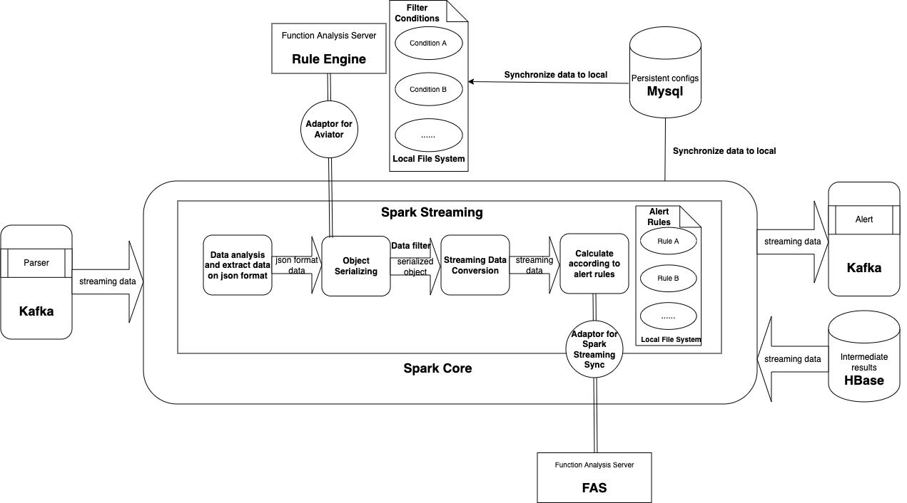
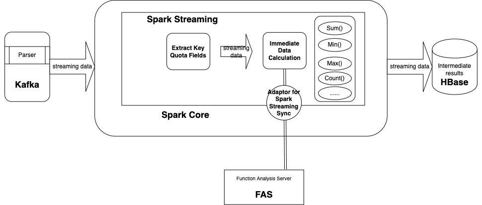

# ivanopt Alert Service

## <span style="color:#7194da">Calculator Arch Design</span>



## <span style="color: #7194da">Preparement</span>

### Zookeeper

#### Start zookeeper distributed by Apache from local 

Any port you prefer could be set, on the other side, the kafka configuration should be revised in consistent. 

```
# cd ${ZK_HOME}
# ./bin/zkServer.sh start

```

### Kafka

#### Start kafka distributed by Apache from local

```
# cd ${KAFKA_HOME}
# ./bin/kafka-server-start.sh ./config/server.properties

```

#### Create topic

```
# cd ${KAFKA_HOME}
# ./bin/kafka-topics.sh --create --zookeeper localhost:1102 --replication-factor 1 --partitions 1 --topic alert

```

#### Start a consumer from beginning

```
# cd ${KAFKA_HOME}
# ./bin/kafka-console-consumer.sh --bootstrap-server localhost:9092 --topic alert --from-beginning

```

### HBase

In case that spark-submit demands hbase related lib path using --driver-class-path, if you are out of the environment, first of all you need to set the ${HBASE_PATH}.

#### Set ${HBASE_PATH}

```
# HBASE_PATH=`${HBASE_HOME}/bin/hbase classpath`

```


#### Start hbase distributed by Apache from local

```
# cd ${HBASE_HOME}
# ./bin/start-hbase.sh

```

#### Communite via command line

```
# cd ${HBASE_HOME}
# ./bin/hbase shell

```

#### Create namespace

```
# create_namespace 'alert'

```

#### Create table

```
# create 'alert:intermediate', 'calculator'

```

#### Put value

```
# put 'alert:intermediate', '1:1234567890', 'calculator:sum', 10000
# put 'alert:intermediate', '1:1234567890', 'calculator:avg', 1000.5

```

#### Scan value

```
# scan 'alert:intermediate'

```
output: 

```
ROW                           COLUMN+CELL                                                                          
 1:1234567890                 column=calculator:avg, timestamp=1528363379556, value=1000.5                         
 1:1234567890                 column=calculator:sum, timestamp=1528363313002, value=10000                          
```

## <span style="color: #7194da">Run the Application</span>

### Local Model

```
# spark-submit --master local[2] --jars ./target/ivanopt-alert-service-1.0.0-SNAPSHOT-jar-with-dependencies-exclude-ivanopt.jar --class com.ivanopt.trigger.MessageConsumerTrigger ./target/ivanopt-alert-service-1.0.0-SNAPSHOT.jar

# spark-submit --master local[2] --jars ./target/ivanopt-alert-service-1.0.0-SNAPSHOT-jar-with-dependencies-exclude-ivanopt.jar --class com.ivanopt.trigger.MessageProducerTrigger ./target/ivanopt-alert-service-1.0.0-SNAPSHOT.jar

# spark-submit --master local[2] --driver-class-path $HBASE_PATH  --jars ./target/ivanopt-alert-service-1.0.0-SNAPSHOT-jar-with-dependencies-exclude-ivanopt.jar --class com.ivanopt.trigger.IntermediateDataLoadTrigger ./target/ivanopt-alert-service-1.0.0-SNAPSHOT.jar

# spark-submit --master local[2] --driver-class-path $HBASE_PATH  --jars ./target/ivanopt-alert-service-1.0.0-SNAPSHOT-jar-with-dependencies-exclude-ivanopt.jar --class com.ivanopt.trigger.IntermediateDataStoreTrigger ./target/ivanopt-alert-service-1.0.0-SNAPSHOT.jar

# spark-submit --master local[2] --driver-class-path $HBASE_PATH  --jars ./target/ivanopt-alert-service-1.0.0-SNAPSHOT-jar-with-dependencies-exclude-ivanopt.jar --class com.ivanopt.trigger.FireCalculatorTrigger ./target/ivanopt-alert-service-1.0.0-SNAPSHOT.jar

# spark-submit --master local[2] --driver-class-path $HBASE_PATH  --jars ./target/ivanopt-alert-service-1.0.0-SNAPSHOT-jar-with-dependencies-exclude-ivanopt.jar --class com.ivanopt.trigger.FireIntermediateDataStoreTrigger ./target/ivanopt-alert-service-1.0.0-SNAPSHOT.jar

# spark-submit --master local[2] --driver-class-path $HBASE_PATH  --jars ./target/ivanopt-alert-service-1.0.0-SNAPSHOT-jar-with-dependencies-exclude-ivanopt.jar --class com.ivanopt.scheduler.FireAlertIntermediateDataCalculatorScheduler ./target/ivanopt-alert-service-1.0.0-SNAPSHOT.jar

```

### Cluster Model

```
# spark-submit --master local[2] --num-executors 3 --driver-memory 4G --executor-memory 4G --executor-cores 4  --conf spark.executorEnv.JAVA_HOME=/home/alert/jdk1.7.0_80/ --conf  spark.yarn.keytab=/tmp/ivan.keytab --conf spark.yarn.principal=ivan@CS1ivanopt.COM --driver-class-path $HBASE_PATH  --jars ivanopt-alert-service-1.0.0-SNAPSHOT-jar-with-dependencies-exclude-ivanopt.jar --class com.ivanopt.trigger.FireCalculatorTrigger ivanopt-alert-service-1.0.0-SNAPSHOT.jar

# spark-submit --master local[2] --num-executors 3 --driver-memory 4G --executor-memory 4G --executor-cores 4  --conf spark.executorEnv.JAVA_HOME=/home/alert/jdk1.7.0_80/ --conf  spark.yarn.keytab=/tmp/ivan.keytab --conf spark.yarn.principal=ivan@CS1ivanopt.COM --driver-class-path $HBASE_PATH  --jars ivanopt-alert-service-1.0.0-SNAPSHOT-jar-with-dependencies-exclude-ivanopt.jar --class com.ivanopt.trigger.FireIntermediateDataStoreTrigger ivanopt-alert-service-1.0.0-SNAPSHOT.jar

```


## <span style="color: #7194da">Data Import Guide</span>

You should set or locate the ${KAFKA_HOME} and ${DATA_HOME} before the following execution, in advance read the script is recommended.

```
# sh message_producer_kafka.sh streaming-data-tool dsg_test_data

```

## <span style="color: #7194da">Intermediate Data Arch Design</span>




### Schema Overview

#### Kafka Source

```
{"createdTime":"1529463080815","owner":"DSG","tableName":"TDRWT","operationType":"I","columnNum":"13","opTs":"2018-04-25 17:34:04","scn":"60567446989","seqid":"6840","tranid":"844476469779330","loaderTime":"2018-04-25 18:22:28","rowid":"AAApMdAAHAAH6xgAAO","afterColumnList":[{"WTH":"402310","SBWTH":"0000402310","KHH":"106700063429","KHXM":"李建南","YYB":"1067","KHQZ":"0A","GSFL":"00","JYS":"SZ","GDH":"0124678679","WTLB":"14","CXBZ":"O","CXWTH":"0","ZQDM":"002923","ZQMC":"润都股份","ZQLB":"A4","DDLX":"0","DDJYXZ":"0","DDSXXZ":"0","DDYXRQ":"0","WTSL":"1000","ZDPLSL":"0","WTJG":"17.01","ZSXJ":"0","WTRQ":"20171226","WTSJ":"12:42:05","BPGDH":"0124678679","SBJB":"0","SBRQ":"20171226","SBSJ":"13:00:20","SBGY":"System  ","SBXW":"226200","SBJLH":"0","JYSDDBH":"0","SBJG":"2","JGSM":"已申报","CDSL":"0","CJSL":"0","CJJE":"0","BRCJSL":"0","BRCJJE":"0","CJJG":"0","CJSJ":"00:00:00","BZ":"RMB","JSLX":"1","JSJG":"NYYH","JSZH":"10670006342901","ZHGLJG":"1067","LSH_ZQDJXM":"0","LSH_ZJDJXM":"0","DJZJ":"0","QSZJ":"0","FSYYB":"0000","WTGY":"HXZB04  ","FHGY":"","WTFS":"32","CZZD":"13868608302","PLWTPCH":"402310","YWSQH":"0","ISIN":"","XWZBH":"-113","TDBH":"3","BZS1":"0","SQCZRH":"","CJBS":"0","STEP":""}]}

```

#### Intermediate Data Source

```
 1_201806181514                              column=c:count, timestamp=1529306082450, value=55                                                                               
 2_201806181514                              column=c:count, timestamp=1529306083100, value=55                                                                               
 3_201806181514                              column=c:avg, timestamp=1529306084072, value=14.0                                                                               
 4_201806181514                              column=c:max, timestamp=1529306084769, value=16.0                                                                               
 5_201806181514                              column=c:min, timestamp=1529306085248, value=12.0                                                                               
 6_201806181514                              column=c:value_count, timestamp=1529306085705, value=0                                                                          
 7_201806181514                              column=c:sum, timestamp=1529306086213, value=770.0                                                                              
 8_201806181514                              column=c:distinct, timestamp=1529306086649, value=5                                                                             
```

#### Alert config

##### ColumnStatsAlert

* avg

```
{"filterInfo" : "filter_create1", "name" : "Column_alert_test", "timeNum" : 5, "description" : "Column_alert_test", "timeUnit" : "min", "id" : 6, "statsType" : "avg", "status" : "ENABLE", "alertType" : "ColumnStatsAlert", "threshold" : 1000, "statsField" : "response_len", "validationTime" : "2018-05-30 00:00:00", "compareType" : "gt", "sourceEntity" : "securities", "caculationTime" : "2018-05-29 22:00:00"}

```
* distinct

```
{"filterInfo" : "filter_create1", "name" : "Column_alert_test", "timeNum" : 5, "description" : "Column_alert_test", "timeUnit" : "min", "id" : 6, "statsType" : "distinct", "status" : "ENABLE", "alertType" : "ColumnStatsAlert", "threshold" : 1000, "statsField" : "response_len", "validationTime" : "2018-05-30 00:00:00", "compareType" : "gt", "sourceEntity" : "securities", "caculationTime" : "2018-05-29 22:00:00"}

```

* sum

```
{"filterInfo" : "filter_create1", "name" : "Column_alert_test", "timeNum" : 5, "description" : "Column_alert_test", "timeUnit" : "min", "id" : 6, "statsType" : "sum", "status" : "ENABLE", "alertType" : "ColumnStatsAlert", "threshold" : 1000, "statsField" : "response_len", "validationTime" : "2018-05-30 00:00:00", "compareType" : "gt", "sourceEntity" : "securities", "caculationTime" : "2018-05-29 22:00:00"}

```

* max

```
{"filterInfo" : "filter_create1", "name" : "Column_alert_test", "timeNum" : 5, "description" : "Column_alert_test", "timeUnit" : "min", "id" : 6, "statsType" : "max", "status" : "ENABLE", "alertType" : "ColumnStatsAlert", "threshold" : 1000, "statsField" : "response_len", "validationTime" : "2018-05-30 00:00:00", "compareType" : "gt", "sourceEntity" : "securities", "caculationTime" : "2018-05-29 22:00:00"}

```

* min

```
{"filterInfo" : "filter_create1", "name" : "Column_alert_test", "timeNum" : 5, "description" : "Column_alert_test", "timeUnit" : "min", "id" : 6, "statsType" : "min", "status" : "ENABLE", "alertType" : "ColumnStatsAlert", "threshold" : 1000, "statsField" : "response_len", "validationTime" : "2018-05-30 00:00:00", "compareType" : "gt", "sourceEntity" : "securities", "caculationTime" : "2018-05-29 22:00:00"}

```

##### EventCountAlert

```
{"filterInfo" : "filter_create1", "name" : "event_count_test", "timeNum" : 1, "description" : "event_count_test1", "timeUnit" : "min", "id" : 5, "statsType" : "count", "status" : "ENABLE", "alertType" : "EventCountAlert", "threshold" : 1, "statsField" : "", "validationTime" : "2018-06-28 11:00:00", "compareType" : "gt", "sourceEntity" : "securities", "caculationTime" : "2018-06-28 09:00:00"}

```

##### ContinuousStatsAlert

```
{"filterInfo" : "mac = ''", "name" : "Continuous_alert_test", "timeNum" : 5, "description" : "Continuous_alert_test", "timeUnit" : "min", "id" : 7, "fieldValue" : "400", "statsType" : "value_count", "status" : "ENABLE", "alertType" : "ContinuousStatsAlert", "threshold" : 1000, "statsField" : "status", "validationTime" : "2018-05-30 00:00:00", "compareType" : "gt", "sourceEntity" : "securities", "caculationTime" : "2018-05-29 22:00:00"}

```

##### BaselineStatsAlert

* left

```
 {"filterInfo" : "filter_create1", "name" : "Baseline_alert_test", "timeNum" : 5, "description" : "BaselineStats_alert_test", "timeUnit" : "min", "baselineSection" : "left", "baselineMin" : 30.0, "baselineMax" : 70.0, "id" : 9, "statsType" : "range", "status" : "ENABLE", "alertType" : "BaselineStatsAlert", "baselineTimeRange" : "yesterday", "statsField" : "status", "validationTime" : "2018-05-30 00:00:00", "sourceEntity" : "securities", "caculationTime" : "2018-05-29 22:00:00"}

 ```

* middle

```
 {"filterInfo" : "filter_create1", "name" : "Baseline_alert_test", "timeNum" : 5, "description" : "BaselineStats_alert_test", "timeUnit" : "min", "baselineSection" : "among", "baselineMin" : 30.0, "baselineMax" : 70.0, "id" : 9, "statsType" : "range", "status" : "ENABLE", "alertType" : "BaselineStatsAlert", "baselineTimeRange" : "yesterday", "statsField" : "status", "validationTime" : "2018-05-30 00:00:00", "sourceEntity" : "securities", "caculationTime" : "2018-05-29 22:00:00"}

 ```

* right

```
 {"filterInfo" : "filter_create1", "name" : "Baseline_alert_test", "timeNum" : 5, "description" : "BaselineStats_alert_test", "timeUnit" : "min", "baselineSection" : "right", "baselineMin" : 30.0, "baselineMax" : 70.0, "id" : 9, "statsType" : "range", "status" : "ENABLE", "alertType" : "BaselineStatsAlert", "baselineTimeRange" : "yesterday", "statsField" : "status", "validationTime" : "2018-05-30 00:00:00", "sourceEntity" : "securities", "caculationTime" : "2018-05-29 22:00:00"}

 ```

##### GroupStatsAlert

```
{"filterInfo" : "filter_create1", "name" : "Group_alert_test1", "timeNum" : 5, "description" : "Group_alert_test1", "timeUnit" : "min", "id" : 12, "statsType" : "group_count", "status" : "ENABLE", "alertType" : "GroupStatsAlert", "threshold" : 1000, "statsField" : "mac,ip", "validationTime" : "2018-05-30 00:00:00", "compareType" : "gt", "sourceEntity" : "securities", "caculationTime" : "2018-05-29 22:00:00"}

```
